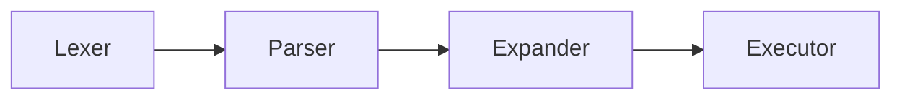

# 🐚 Minishell

A beautiful, functional, and simplified shell implementation modeled after Bash. This project is a foundational exercise in understanding process management, system calls, and parsing in C.

---

## 🚀 Overview

**Minishell** is a minimal command-line interpreter that mimics basic Bash functionality. It handles everything from simple commands to complex pipelines and redirections, all while maintaining a clean and robust architecture.

> [!NOTE]
> This project was developed as part of the 42 school curriculum.

---

## ✨ Features

### 🛠️ Built-in Commands
- `echo` with `-n` option
- `cd` with relative or absolute paths
- `pwd`
- `export` (with no arguments or to set environment variables)
- `unset`
- `env` (to display environment variables)
- `exit`

### 🔗 Pipelines & Redirections
- **Pipes (`|`)**: Connect multiple commands; output of one is the input of the next.
- **Redirections**:
  - `<` : Redirect input.
  - `>` : Redirect output (overwrite).
  - `>>`: Redirect output (append).
  - `<<`: Heredoc (stops when delimiter is found).

### 💬 Shell Features
- **Prompt**: Displays `minishell$> ` and waits for user input.
- **History**: Full working history using `readline`.
- **Environment Expansion**: Expands `$VAR` and `$?` (status of the last command).
- **Quotes**: Handles `'single quotes'` (prevents expansion) and `"double quotes"` (allows `$`).
- **Signal Handling**: Robust handling of `Ctrl-C`, `Ctrl-D`, and `Ctrl-\` just like Bash.

---

## 🏗️ Architecture

The shell follows a classic 4-stage pipeline:



1.  **Lexer**: Tokenizes the input string into individual components (words, operators).
2.  **Parser**: Builds an **Abstract Syntax Tree (AST)** to define command execution order.
3.  **Expander**: Evaluates environment variables and handles quote removal.
4.  **Executor**: Launches processes, handles redirections, and manages pipes.

---

## 🛠️ Installation & Usage

### 📥 Prerequisites
- `gcc` or `cc`
- `make`
- `readline` library

### 🔨 Building the Project
```bash
# Clone the repository
git clone https://github.com/sborshikHlama/minishell.git
cd minishell

# Compile
make
```

### 🏃 Running Minishell
```bash
./minishell
```

---

## 🧪 Testing & Debugging

The project includes specialized tools for development:

- **Memory Leaks**:
  ```bash
  make memleak
  ```
- **Norminette Check**:
  ```bash
  make norm
  ```
- **Cleaning Up**:
  ```bash
  make fclean
  ```

---

## 👥 Authors
- [aevstign](https://github.com/aevstign)
- [iasonov](https://github.com/iasonov)

---

## 📄 License
This project is open-source and available under the MIT License.
